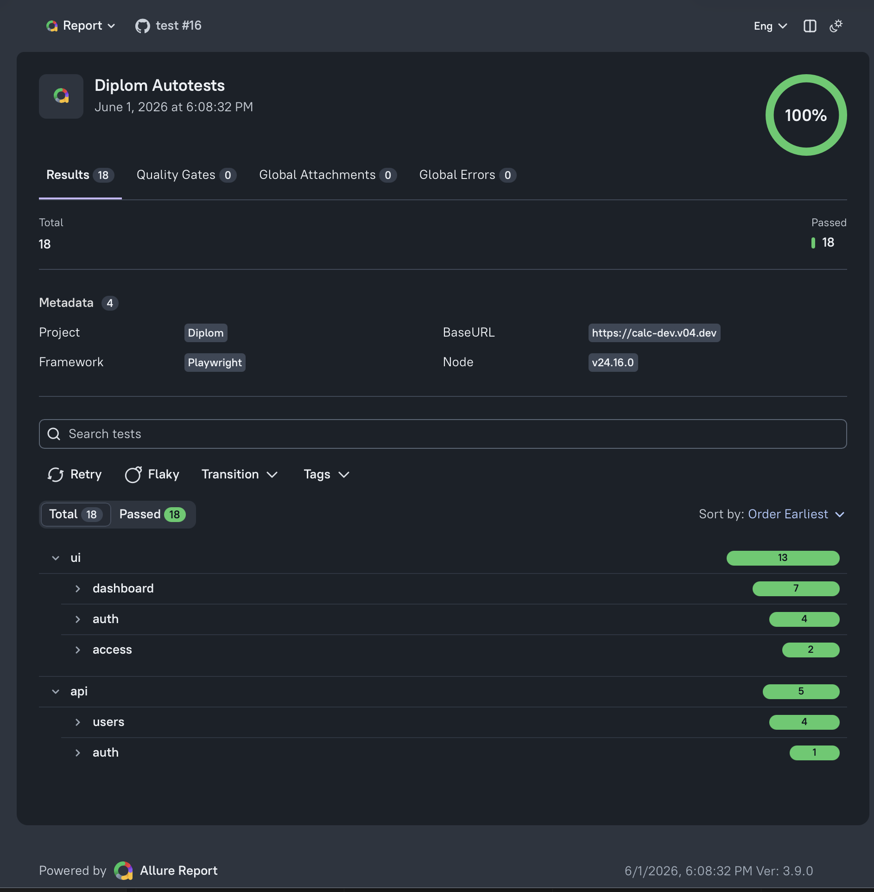
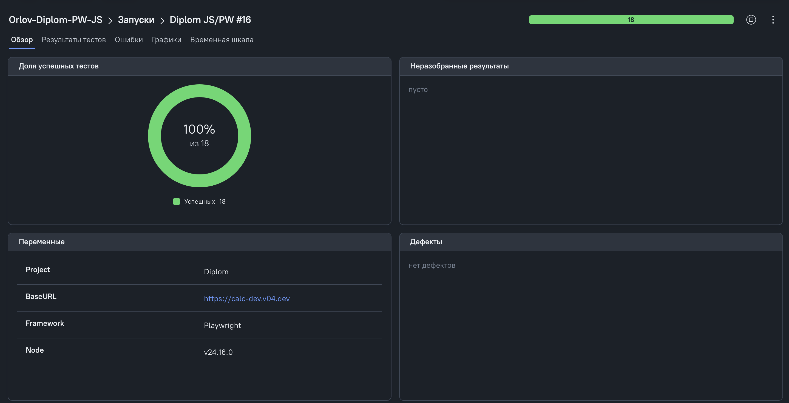
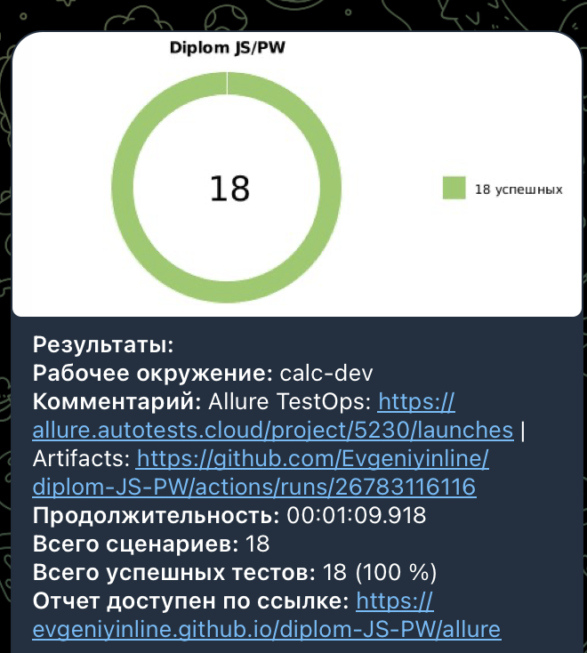

# Diplom Autotests

[](https://github.com/Evgeniyinline/diplom-JS-PW/actions/workflows/playwright.yml)

Дипломный проект по автоматизации тестирования для приложения "Калькулятор КП".

Проект демонстрирует UI и API автотесты на Playwright с использованием Page Object, Service layer, генераторов тестовых данных, Allure Report, Allure TestOps, Telegram-уведомлений и GitHub Actions.

## Ссылки

- GitHub Actions: https://github.com/Evgeniyinline/diplom-JS-PW/actions
- Allure Report: https://evgeniyinline.github.io/diplom-JS-PW/
- Allure TestOps: https://allure.autotests.cloud/project/5230/launches

## Стек


В проекте используется:

- JavaScript и Playwright для UI/API автотестов;
- Page Object и компоненты для UI-слоя;
- Service layer и controllers для API-слоя;
- builders на Faker для генерации тестовых данных;
- Allure Report 3 для локальных и GitHub Pages отчётов;
- Allure TestOps для хранения запусков;
- GitHub Actions для CI;
- qa-guru/allure-notifications для Telegram-уведомлений с диаграммой прохождения тестов.

## Что покрыто

Всего в проекте 18 автотестов: 13 UI и 5 API.

### UI

UI-тесты находятся в `tests/ui`.

Покрытие UI:

1. Визуальная проверка страницы авторизации.
2. Негативная авторизация с неверными учётными данными.
3. Валидация пустой формы авторизации.
4. Авторизация и переход в личный кабинет.
5. Проверка ролевого доступа администратора.
6. Проверка ролевого доступа менеджера.
7. Поиск КП: empty state, найденный результат и очистка поиска.
8. Создание КП и проверка отображения в списке.
9. Создание КП для калькуляторов `Base · RUB`, `Pro · RUB`, `KZ · KZT`.

В UI-тестах используются:

- Page Object: `src/pages`;
- компоненты: `src/components`;
- fixtures: `src/helpers/fixtures/fixture.js`;
- генератор данных: `src/helpers/builders/proposal.builder.js`.

### API

API-тесты находятся в `tests/api`.

Покрытие API:

1. `POST/GET` получение `better-auth` токена администратора.
2. `POST` создание пользователя.
3. `POST/GET` создание пользователя и получение по `id`.
4. `POST/PUT/GET` обновление роли пользователя `manager -> admin -> manager`.
5. `POST/GET/DELETE` создание пользователя, удаление и проверка `404`.

В API-тестах используются:

- Controllers: `src/controllers`;
- Services: `src/services`;
- Facade: `src/helpers/facades/auth.facade.js`;
- генератор пользователей: `src/helpers/builders/user.builder.js`;
- теги HTTP-методов: `@POST`, `@GET`, `@PUT`, `@DELETE`.

## Структура проекта

```text
.
├── .github/workflows/           # GitHub Actions
├── scripts/                     # служебные скрипты
├── src/
│   ├── components/              # UI components
│   ├── controllers/             # API controllers
│   ├── helpers/
│   │   ├── builders/            # генераторы тестовых данных
│   │   ├── cleanup/             # очистка тестовых данных
│   │   ├── facades/             # фасады для сервисов
│   │   └── fixtures/            # Playwright fixtures
│   ├── pages/                   # Page Object
│   └── services/                # API service layer
├── tests/
│   ├── api/                     # API автотесты
│   ├── ui/                      # UI автотесты
│   └── global.teardown.js       # пост-очистка тестовых данных
├── allurerc.mjs                 # конфиг Allure Report 3
├── playwright.config.js         # конфиг Playwright
└── package.json
```

## Установка

```bash
npm ci
npx playwright install --with-deps
```

## Переменные окружения

По умолчанию тесты используют тестового администратора из проекта.

Можно переопределить данные через переменные окружения:

```bash
E2E_EMAIL=admin@example.com
E2E_PASSWORD=password
```

Файлы `.env` и `.env.*` добавлены в `.gitignore` и не должны попадать в репозиторий.

## Запуск тестов

Запустить все тесты:

```bash
npm test
```

Запустить Playwright UI mode:

```bash
npm run test:ui
```

Запустить только API-тесты:

```bash
npm run test:api
```

Запуск API-тестов по HTTP-тегам:

```bash
npm run test:api:post
npm run test:api:get
npm run test:api:put
npm run test:api:delete
```

## Allure Report

Сгенерировать Allure-отчёт и открыть его локально:

```bash
npm run test:report
```

Сгенерировать отчёт без открытия сервера:

```bash
npm run test:report -- --no-open
```

Открыть уже сгенерированный отчёт:

```bash
npm run allure:open
```

Локальная ссылка отчёта:

```text
http://localhost:9323
```

Allure results и report не коммитятся:

```text
allure-results/
allure-report/
```

## Очистка тестовых данных

Проект создаёт временных пользователей для API и UI тестов.

После успешных тестов созданные пользователи автоматически добавляются в очередь очистки и удаляются в `global.teardown.js`.

Если тест упал, пользователь не удаляется автоматически. Это сделано специально, чтобы можно было разобрать состояние данных после падения.

Служебные файлы очистки хранятся в:

```text
.test-artifacts/
```

Эта папка добавлена в `.gitignore`.

## CI

В проекте настроен GitHub Actions workflow:

```text
.github/workflows/playwright.yml
```

Workflow запускается на `push`, `pull_request` и вручную через `workflow_dispatch`.

Что делает workflow:

- устанавливает зависимости;
- устанавливает браузеры Playwright;
- запускает тесты через `allurectl watch`;
- передаёт результаты запуска в Allure TestOps;
- сохраняет Playwright report как artifact;
- генерирует Allure Report;
- сохраняет Allure Report как artifact;
- публикует Allure Report в GitHub Pages с сохранением history;
- отправляет результат запуска в Telegram через `qa-guru/allure-notifications` вместе с диаграммой прохождения тестов.

Allure Report доступен по ссылке:

```text
https://evgeniyinline.github.io/diplom-JS-PW/
```

Для Telegram-уведомлений в настройках репозитория добавлены secrets:

```text
TELEGRAM_BOT_TOKEN
TELEGRAM_CHAT_ID
```

Для отправки результатов в Allure TestOps используется проект:

```text
Orlov-Diplom-PW-JS
Project ID: 5230
Endpoint: https://allure.autotests.cloud/
```

Для отправки результатов в TestOps в настройках репозитория добавлен secret:

```text
ALLURE_TOKEN
```

## Статус дипломного задания

- UI автоматизация: 5+ функциональных тестов с Page Object и генератором данных.
- API автоматизация: 5 функциональных тестов с Service layer и генератором данных.
- CI/CD: автотесты запускаются в GitHub Actions.
- Telegram: уведомления о результате запуска отправляются ботом.
- Reporting: Allure Report публикуется в GitHub Pages с history.
- Allure TestOps: результаты запуска передаются через `allurectl`.
- Скриншоты Allure Report, Allure TestOps и Telegram-уведомления добавлены в README.

## Скриншоты

### Allure Report



### Allure TestOps



### Telegram Notification



## Полезные команды

```bash
# все тесты
npm test

# API
npm run test:api

# API по тегам
npm run test:api:post
npm run test:api:get
npm run test:api:put
npm run test:api:delete

# Allure
npm run test:report
npm run allure:open
```
