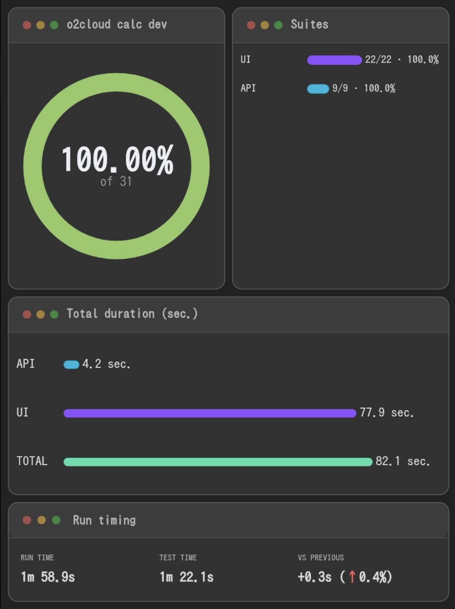
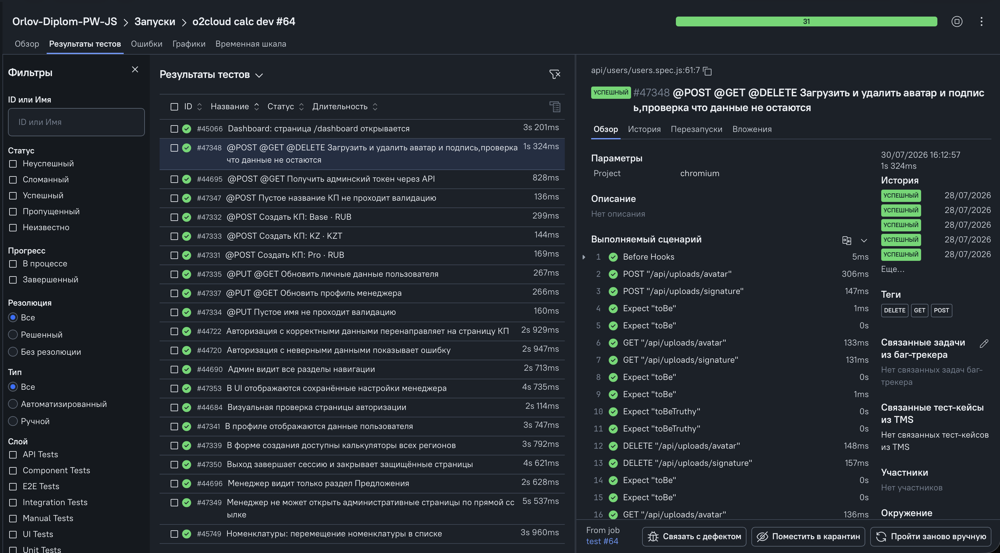
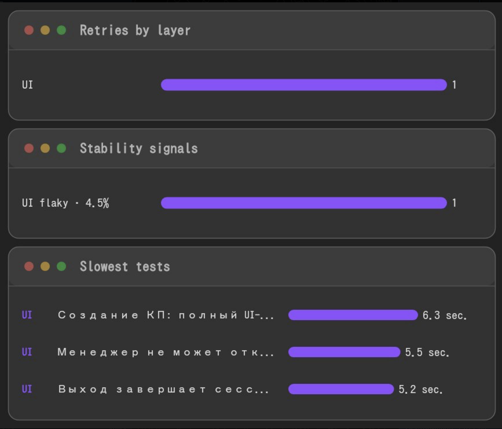

# Diplom Autotests

[](https://github.com/Evgeniyinline/diplom-JS-PW/actions/workflows/playwright.yml)

Дипломный проект по автоматизации тестирования для приложения "Калькулятор КП".

Проект демонстрирует UI и API автотесты на Playwright с использованием Page Object, компонентов, Controller → Service → Facade слоя для API, fixtures, builders, Allure Report, Allure TestOps, Telegram-уведомлений и GitHub Actions.

## Ссылки

- GitHub Actions: https://github.com/Evgeniyinline/diplom-JS-PW/actions
- Allure Report: https://evgeniyinline.github.io/diplom-JS-PW/
- Allure TestOps: https://allure.autotests.cloud/project/5230/launches

## Стек


В проекте используется:

- JavaScript и Playwright для UI/API автотестов;
- Page Object и компоненты для UI-слоя;
- Controller → Service → Facade для API-слоя;
- fixtures для подготовки авторизованных UI/API контекстов;
- builders на Faker для генерации тестовых данных;
- Allure Report 3 для локальных и GitHub Pages отчётов;
- Allure TestOps для хранения запусков;
- GitHub Actions для CI;
- qa-guru/allure-notifications для Telegram-уведомлений с диаграммой прохождения тестов.

## Что покрыто

Всего в проекте 25 автотестов: 17 UI и 8 API.

### UI

UI-тесты находятся в `tests/ui`.

Покрытие UI:

1. Визуальная проверка страницы авторизации.
2. Негативная авторизация с неверными учётными данными.
3. Валидация пустой формы авторизации.
4. Авторизация с корректными данными и переход на страницу КП.
5. Проверка ролевого доступа администратора.
6. Проверка ролевого доступа менеджера.
7. Поиск КП: empty state, найденный результат и очистка поиска.
8. Полный UI-флоу создания КП `Pro · RUB`: открытие, валюта и отображение в списке.
9. Наличие калькуляторов `Base · RUB`, `Pro · RUB`, `KZ · KZT` в форме создания.
10. Открытие страницы dashboard.
11. Создание КП из dashboard.
12. Перемещение номенклатуры в списке и возврат на исходную позицию.
13. Открытие страницы профиля и проверка активной вкладки.
14. Отображение личных данных пользователя в профиле.
15. Полный сценарий редактирования профиля: валидация имени, изменение данных, загрузка, сохранение и удаление аватара и подписи.

В UI-тестах используются:

- Page Object: `src/pages`;
- компоненты: `src/components`;
- fixtures: `src/helpers/fixtures/fixture.js`;
- генераторы данных: `src/helpers/builders`.

Основные UI-спеки:

- `tests/ui/auth/auth.spec.js` — авторизация и валидации формы входа;
- `tests/ui/access/roles.spec.js` — проверка доступности разделов для ролей `admin` и `manager`;
- `tests/ui/dashboard/proposals.spec.js` — поиск, создание КП и создание КП из dashboard;
- `tests/ui/nomenclatures/nomenclatures.spec.js` — drag-and-drop перемещение номенклатуры;
- `tests/ui/profile/profile.spec.js` — просмотр и редактирование профиля, загрузка аватара и подписи.

### API

API-тесты находятся в `tests/api`.

Покрытие API:

1. `POST/GET` получение `better-auth` токена администратора.
2. `PUT/GET` изменение личных данных пользователя и проверка результата.
3. `PUT` проверка валидации пустого имени.
4. `PUT/GET` изменение данных профиля менеджера и проверка результата.
5. `POST/GET/DELETE` загрузка, получение и удаление аватара и подписи.
6. `POST` создание КП для калькуляторов `Base · RUB`, `Pro · RUB`, `KZ · KZT`.

В API-тестах используются:

- Controllers: `src/controllers`;
- Services: `src/services`;
- Facades: `src/helpers/facades/auth.facade.js`, `src/helpers/facades/profile.facade.js`, `src/helpers/facades/proposals.facade.js`;
- генератор пользователей: `src/helpers/builders/user.builder.js`;
- тестовые изображения: `test-data/profile`;
- теги HTTP-методов: `@POST`, `@GET`, `@PUT`, `@DELETE`.

## Структура проекта

```text
.
├── .github/workflows/           # GitHub Actions
├── scripts/                     # служебные скрипты
├── src/
│   ├── components/              # UI components
│   ├── controllers/             # API controllers
│   ├── helpers/
│   │   ├── auth/                # storage state администратора
│   │   ├── builders/            # генераторы тестовых данных
│   │   ├── cleanup/             # очистка тестовых данных
│   │   ├── facades/             # фасады для сервисов
│   │   └── fixtures/            # Playwright fixtures
│   ├── pages/                   # Page Object
│   └── services/                # API service layer
├── test-data/
│   └── profile/                 # аватар и подпись для API/UI тестов
├── tests/
│   ├── api/                     # API автотесты
│   ├── ui/                      # UI автотесты
│   ├── global.setup.js          # авторизация администратора через API
│   └── global.teardown.js       # пост-очистка тестовых данных
├── allurerc.mjs                 # конфиг Allure Report 3
├── playwright.config.js         # конфиг Playwright
└── package.json
```

## Установка

```bash
npm ci
npx playwright install --with-deps
```

## Переменные окружения

Для локального запуска создайте файл `.env` в корне проекта:

```env
BASE_URL=https://calc-dev.v04.dev
E2E_EMAIL=admin@example.com
E2E_PASSWORD=password
```

Назначение переменных:

- `BASE_URL` — URL тестового стенда.
- `E2E_EMAIL` — email администратора для `global.setup.js`.
- `E2E_PASSWORD` — пароль администратора для `global.setup.js`.

Файл `.env` добавлен в `.gitignore`, поэтому реальные данные не попадут в репозиторий. Пример заполнения лежит в `.env.example`.

## Запуск тестов

Запустить все тесты:

```bash
npm test
```

Тесты запускаются в один worker. Это сделано специально, чтобы внешний тестовый стенд не отвечал `429 Too many requests` на частые API/UI-запросы.

Запустить Playwright UI mode:

```bash
npm run test:ui
```

Запустить только API-тесты:

```bash
npm run test:api
```

Запуск API-тестов по HTTP-тегам:

```bash
npm run test:api:post
npm run test:api:get
npm run test:api:put
npm run test:api:delete
```

## Allure Report

Сгенерировать Allure-отчёт и открыть его локально:

```bash
npm run test:report
```

Сгенерировать отчёт без открытия сервера:

```bash
npm run test:report -- --no-open
```

Открыть уже сгенерированный отчёт:

```bash
npm run allure:open
```

Локальная ссылка отчёта:

```text
http://localhost:9323
```

Allure results и report не коммитятся:

```text
allure-results/
allure-report/
```

## Очистка тестовых данных

Проект создаёт двух временных менеджеров один раз на полный прогон в `global.setup.js`:

- менеджер для обычных UI-тестов получает отдельный `manager-storage-state.json`;
- менеджер для API/UI-тестов профиля получает отдельный `edit-profile-storage-state.json`;
- администратор использует `admin-storage-state.json`.

Фикстуры `managerApp`, `editProfileApi` и `editProfileApp` читают готовые состояния из `.test-artifacts` и не выполняют повторную авторизацию. Поэтому перезапуск worker после падения теста больше не создаёт новых пользователей и cookies.

Оба временных пользователя удаляются один раз в `global.teardown.js` после завершения полного прогона.

В очистке и подготовке данных есть повторные попытки для ответов `429 Too many requests`, потому что тестовый стенд ограничивает частоту запросов.

Служебные файлы очистки хранятся в:

```text
.test-artifacts/
```

Эта папка добавлена в `.gitignore`.

## CI

В проекте настроен GitHub Actions workflow:

```text
.github/workflows/playwright.yml
```

Workflow запускается на `push`, `pull_request` и вручную через `workflow_dispatch`.

Что делает workflow:

- устанавливает зависимости;
- устанавливает браузеры Playwright;
- запускает тесты через `allurectl watch`;
- передаёт результаты запуска в Allure TestOps;
- сохраняет Playwright report как artifact;
- генерирует Allure Report;
- сохраняет Allure Report как artifact;
- публикует Allure Report в GitHub Pages с сохранением history;
- отправляет результат запуска в Telegram через `qa-guru/allure-notifications` вместе с диаграммой прохождения тестов.

Allure Report доступен по ссылке:

```text
https://evgeniyinline.github.io/diplom-JS-PW/
```

Для Telegram-уведомлений в настройках репозитория добавлены secrets:

```text
TELEGRAM_BOT_TOKEN
TELEGRAM_CHAT_ID
```

Для отправки результатов в Allure TestOps используется проект:

```text
Orlov-Diplom-PW-JS
Project ID: 5230
Endpoint: https://allure.autotests.cloud/
```

Для отправки результатов в TestOps в настройках репозитория добавлен secret:

```text
ALLURE_TOKEN
```

## Статус дипломного задания

- UI автоматизация: 17 функциональных тестов с Page Object, компонентами, fixtures и генератором данных.
- API автоматизация: 8 функциональных тестов с Controller → Service → Facade слоем и генератором данных.
- CI/CD: автотесты запускаются в GitHub Actions.
- Telegram: уведомления о результате запуска отправляются ботом.
- Reporting: Allure Report публикуется в GitHub Pages с history.
- Allure TestOps: результаты запуска передаются через `allurectl`.
- Скриншоты Allure Report, Allure TestOps и Telegram-уведомления добавлены в README.

## Скриншоты

### Allure Report



### Allure TestOps



### Telegram Notification



## Полезные команды

```bash
# все тесты
npm test

# API
npm run test:api

# API по тегам
npm run test:api:post
npm run test:api:get
npm run test:api:put
npm run test:api:delete

# Allure
npm run test:report
npm run allure:open
```
